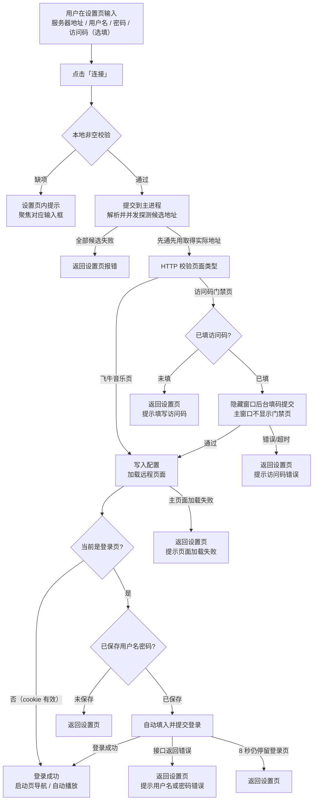

# 设置页登录流程说明

> 适用版本：v3.0.0+
> 描述设置页提交输入后，从连接、过访问码门禁、自动登录，到成功进入音乐页面或失败返回设置页的完整逻辑。

***

## 一、业务部分

### 1. 流程总览



### 2. 角色说明

| 角色           | 职责                                       |
| ------------ | ---------------------------------------- |
| 用户           | 在设置页填写四项信息并点击「连接」；收到失败提示后修正重试            |
| 设置页（渲染层）     | 输入收集、非空校验、提交、展示错误提示并聚焦对应输入框              |
| 主进程          | 地址解析、连接前校验、后台过门禁、配置持久化、加载远程页面、失败时跳回设置页   |
| 隐藏过码窗口       | 不可见 BrowserWindow，与主窗口共享登录分区，负责后台通过访问码门禁 |
| 远程页面（飞牛音乐服务） | 提供门禁页 / 登录页 / 音乐页面                       |

### 3. 详细步骤

#### 阶段一：设置页提交（渲染层）

1. 用户填写：服务器地址（fnid / IP / 网址）、用户名、密码、访问码（选填，placeholder 提示「服务器要求输入访问码时自动填入」）。
2. 点击「连接」后先做本地非空校验：地址、用户名、密码必填，缺项直接在页面内提示并聚焦，**不发起连接**。
3. 校验通过 → 按钮置灰显示「连接中...」→ 通过 IPC 提交 `{ url, username, password, accessCode }` 给主进程。
4. 提交成功后设置页进入等待：若 30 秒内页面仍未跳转（兜底），恢复按钮并提示「连接超时」。

#### 阶段二：地址解析——构造候选列表（主进程）

1. 按输入类型构造**候选地址列表**：

   - fnid：调 fnos.net API 获取候选（多个局域网 http 地址 + 中继 https 地址）；

   - IP / 网址：自动补协议与 `/music/` 后缀；不带协议且不带端口的输入额外追加 5666 端口候选（飞牛 NAS 默认端口）。
2. 解析失败（地址无效 / fnid 解析失败 / 候选为空）→ 返回错误 → 设置页显示提示。

#### 阶段三：并发探测与连接前校验（主进程）

全部候选**同时发起探测，先通先用**——任一候选先验证通过，立即采用其最终真实地址，不再等其余候选（其余探测自然结束）。每个候选的探测流程：

1. 跟随重定向（最多 10 次），确认**最终真实访问地址**（重定向到新地址则用新地址访问）；
2. IPv4 优先、IPv6 兜底（Node 网络层无自动回退，固定先试 IPv4，仅连接层失败才换 IPv6 重试一次）；
3. 对最终响应页面分类：

| 分类     | 判定                                 | 处理                                  |
| ------ | ---------------------------------- | ----------------------------------- |
| 飞牛音乐页  | 页面含「飞牛音乐 / fnmusic / fnos-music」标识 | 校验通过，直接进入阶段五                        |
| 访问码门禁页 | 页面含「请输入访问码 / 请输入访问密码」              | 校验通过，进入阶段四（后台过码）                    |
| 其他页面   | 以上都不满足，或 502 / 404 / 网络错误等         | 该候选落败；全部候选失败 → 返回第一个候选的错误 → 设置页显示提示 |

#### 阶段四：访问码门禁（隐藏窗口后台过码）

1. 未填访问码 → 返回「服务器开启了访问码保护，请在访问密码栏填写后重试」→ 设置页报错。
2. 已填访问码 → 主进程创建 `show: false` 的隐藏 BrowserWindow（与主窗口同 `persist:feiniu` 分区）真实渲染门禁页 → 自动填入访问码（模拟 input/change 事件）→ 点击「确定」。
3. **主窗口全程不显示门禁页**；过码 cookie 落在共享分区，主窗口随后直接加载音乐/登录页。
4. 结果判定：

   - 页面标题不再是门禁标题 → 通过，进入阶段五；

   - 提交 2 次仍停留门禁页，或 20 秒总超时 → 判定访问码错误 → 返回「访问码错误，请检查访问密码后重新连接」→ 设置页报错。

#### 阶段五：进入远程页面与自动登录

1. 校验（含过码）全部通过后，主进程持久化配置（原始输入、用户名、密码、访问码），加载实际访问地址。
2. 加载完成后按当前页面分流：

   - **非登录页**（cookie 有效）→ 登录成功：自动点击启动页导航项、按配置自动播放；

   - **登录页** → 触发自动登录：

     - 未保存用户名/密码 → 跳回设置页；

     - 已保存 → 自动填入并点击登录按钮。

#### 阶段六：自动登录的结果判定

| 结果       | 判定方式                                                                                         | 处理                      |
| -------- | -------------------------------------------------------------------------------------------- | ----------------------- |
| 登录成功     | 页面离开 /login，或登录接口返回成功                                                                        | 进入启动页导航 / 自动播放流程        |
| 用户名或密码错误 | 页面内 hook 拦截 fetch / XHR：登录接口返回 4xx/5xx、常见中文错误文案（密码错误/账号不存在等）、JSON `success:false` 或 `code≠0` | 立即跳回设置页，提示「用户名或密码错误」    |
| 登录无响应    | 登录提交 8 秒后仍停留在 /login（cookie 未拿到）                                                             | 跳回设置页                   |
| 远程页面加载失败 | 主框架加载错误且与目标地址同源（排除用户主动取消）                                                                    | 跳回设置页，提示「页面加载失败（错误码 x）」 |

### 4. 返回设置页的触发场景汇总

| # | 场景                              | 错误提示                           | 自动聚焦   |
| - | ------------------------------- | ------------------------------ | ------ |
| 1 | 地址解析失败 / 候选全部落败（不可达、超时等）        | 按原因（地址无效 / fnid 解析失败 / 候选均不可达） | 服务器地址框 |
| 2 | 全部候选均不是飞牛音乐（含 502 / 404 / 网络错误） | 按状态码分类提示                       | 服务器地址框 |
| 3 | 有门禁但未填访问码                       | 服务器开启了访问码保护，请在访问密码栏填写后重试       | 访问码框   |
| 4 | 访问码错误                           | 访问码错误，请检查访问密码后重新连接             | 访问码框   |
| 5 | 用户名或密码错误                        | 用户名或密码错误                       | 密码框    |
| 6 | 登录 8 秒无响应 / 未保存凭据               | 无提示或上次提示                       | 密码框    |
| 7 | 远程主页面加载失败                       | 页面加载失败（错误码 x）                  | 密码框    |
| 8 | 设置页等待 30 秒未跳转（兜底）               | 连接超时，请检查服务器是否在线                | 无      |

> 应用**启动时**（非设置页提交）同样走阶段二～四：读已保存的原始输入重新解析、校验、过码，任一环节失败都带错误提示跳回设置页。

### 5. 注意事项

1. **访问码与密码均为明文**存储在 `%APPDATA%\feiniu-music\config.json`，仅供个人自用场景。
2. **错误提示一次性消费**：主进程暂存的登录错误被设置页读取后立即清空，重复进入设置页不会重复显示。
3. **门禁主路径在主进程**（隐藏窗口，连接前完成）；主窗口内另有一套看门狗作为兜底——仅当运行中门禁 cookie 意外失效、主窗口真的渲染出门禁页时才动作，访问码错误同样经 IPC 跳回设置页报错。
4. **防循环上限**：门禁提交单页面最多 2 次、总超时 20 秒；主窗口看门狗注入单周期最多 2 次。用尽仍见门禁页即判访问码错误，不会无限重试。
5. **登录失败检测靠页面 hook**（拦截 fetch / XHR），覆盖自动登录与手动在登录页提交两种情况；若服务器错误文案特殊且不在识别列表内，将退化为「8 秒超时」路径返回设置页。
6. `did-fail-load` 仅处理**主框架**且与最近一次连接地址**同源**的失败，排除 `-3 ERR_ABORTED`（用户主动导航），避免子资源失败误伤。
7. 设置页成功提交后的 **30 秒兜底**只恢复按钮，不主动跳转——实际跳转由主进程加载远程页面驱动。
8. **候选地址并发探测（先通先用）**：fnid 的多个局域网 IP / 中继地址、以及普通输入的默认端口与 5666 候选同时发起探测，任一先验证通过立即采用；候选排列顺序（局域网在前、中继在后）仅影响全部失败时的错误提示取第一个候选的错误。
9. **IPv4 优先、IPv6 兜底**：探测用 Node 原生 http 模块（无 Happy Eyeballs 自动回退），固定先试 IPv4，仅连接层失败（DNS 失败 / 超时 / 拒绝连接等）才换 IPv6 重试；避免 Win11 有 IPv6 但链路不通时卡满超时。证书错误、已收到响应的错误不换栈重试。

***

## 二、代码实现部分

### 1. 涉及文件与职责

| 文件           | 职责                                                                                                 |
| ------------ | -------------------------------------------------------------------------------------------------- |
| `setup.html` | 设置页结构与样式（四个输入框、连接按钮、错误提示区）                                                                         |
| `setup.js`   | 输入收集、非空校验、IPC 提交、错误展示与聚焦、30 秒兜底                                                                    |
| `preload.js` | contextBridge 暴露 `serverBridge`（submit / getLoginError / notifyLoginFail / notifyAccessCodeFail 等） |
| `main.js`    | 地址解析、连接前校验、隐藏窗口过码、自动登录、失败跳回设置页                                                                     |

### 2. 关键函数（main.js）

| 函数                                      | 作用                                                                       |
| --------------------------------------- | ------------------------------------------------------------------------ |
| `resolveAccessUrl(input)`               | 统一解析输入为实际访问地址（fnid / IP / 网址），内部构造候选并并发探测                                |
| `probeCandidates(candidates)`           | 并发探测候选地址（先通先用），返回胜出候选重定向后的最终真实地址                                         |
| `classifyPage(body)`                    | 页面分类：`gate`（门禁）/ `fnmusic`（飞牛页）/ `other`                                 |
| `verifyFnMusic(url)`                    | 单候选 HTTP 校验：跟随重定向 + 页面识别 + IPv4 优先 / IPv6 兜底，返回 `{ ok, gate, finalUrl }` |
| `passGateInBackground(url, accessCode)` | 隐藏窗口后台过门禁，返回 `passed` / `wrong-code` / `no-code`                         |
| `applyServerUrl(url)`                   | 设置允许的 origin 并 loadURL 加载远程页面                                            |
| `tryAutoLogin()`                        | 登录页自动填入凭据并提交                                                             |
| `injectLoginFailHook()`                 | hook fetch / XHR 捕获登录接口错误                                                |
| `loadSetup()`                           | 跳回设置页（清空 allowedOrigin / lastServerUrl）                                  |
| `pendingLoginError`                     | 暂存待设置页展示的错误文案（读取即清空）                                                     |

### 3. IPC 通道清单

| 通道                 | 方向                 | 用途                                                               |
| ------------------ | ------------------ | ---------------------------------------------------------------- |
| `submit-server`    | 设置页 → 主进程（invoke）  | 提交 `{ url, username, password, accessCode }`，返回 `{ ok, error? }` |
| `get-saved-input`  | 设置页 → 主进程（invoke）  | 预填已保存的地址 / 用户名 / 访问码                                             |
| `get-login-error`  | 设置页 → 主进程（invoke）  | 读取并清空 `pendingLoginError`                                        |
| `login-fail`       | 远程页面 → 主进程（invoke） | hook 检测到登录接口失败，跳回设置页                                             |
| `access-code-fail` | 远程页面 → 主进程（invoke） | 主窗口看门狗检测到访问码错误，跳回设置页                                             |

### 4. 核心流程伪代码

```js
// submit-server（主进程）
async function onSubmit({ url, username, password, accessCode }) {
  // 阶段二+三：构造候选并发探测（先通先用），verified 为胜出候选的验证结果
  const { url: realUrl, verified } = await resolveAccessUrl(url);
  if (!realUrl) return { ok: false, error: '地址解析失败' };

  const v = verified || await verifyFnMusic(realUrl);  // 复用探测结果，一般无需重复验证
  if (!v.ok) return { ok: false, error: v.error };

  if (v.gate) {                                             // 阶段四
    const r = await passGateInBackground(realUrl, accessCode);
    if (r !== 'passed') return { ok: false, error: r === 'no-code' ? '请填写访问码' : '访问码错误' };
  }

  writeConfig({ serverInput, username, password, accessCode }); // 持久化
  applyServerUrl(realUrl);                                   // 阶段五：loadURL
  return { ok: true };
}

// 设置页提交后（setup.js）
const res = await serverBridge.submit(payload);
if (!res.ok) {
  showMsg(res.error);            // 显示错误并恢复按钮
} else {
  waitNavigationOrTimeout(30000); // 等待跳转，30s 兜底恢复按钮
}

// 自动登录失败（主进程，任一触发即 loadSetup）
// ① hook 检测登录接口错误 → pendingLoginError = '用户名或密码错误'
// ② 8 秒后仍在 /login → loadSetup()
// ③ 未保存凭据且在登录页 → loadSetup()

// 设置页加载时读取错误（setup.js）
const errMsg = await serverBridge.getLoginError();
if (errMsg) {
  showMsg(errMsg);
  focus(errMsg.includes('访问码') ? accesscodeInput : passwordInput);
}
```

### 5. 状态与配置

- 持久化分区：`persist:feiniu`（cookies / localStorage 落盘 `userData`，登录态重启保留）

- 配置文件：`%APPDATA%\feiniu-music\config.json`

  - `serverInput`：用户原始输入（每次启动重新解析）

  - `username` / `password`：登录凭据

  - `accessCode`：访问码（清空保存即删除该字段）

